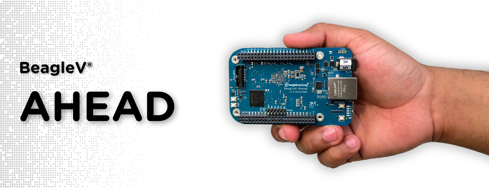

# BeagleV-Ahead

## Links

* Terms and conditions: https://docs.beagleboard.org/latest/boards/terms-and-conditions
* Documentation: https://docs.beagleboard.org/latest/boards/beaglev/ahead
* Design: https://git.beagleboard.org/beaglev-ahead/beaglev-ahead
* Support: https://forum.beagleboard.org/tags/c/beaglev/15/ahead
* Repair: https://www.beagleboard.org/rma
* Purchase: https://beaglev-ahead.org

## Features

* T-Head TH1520 AI system-on-chip processor
   * Quad-core XuanTie C910 open-source RTL RISC-V (RV64GCV ISA) CPU @ 2GHz
     * 3 issue, 8 instruction, 9-12 stage pipeline
     * In-order fetch, out-of-order launch, out-of-order completion and in-order retirement
     * 64KB I-cache, 64KB D-cache per core
   * AI NPU with 4TOPS INT8 @ 1GHz
     * Support for TensorFlow, ONNX, Caffe
     * Feature extraction accelerator
   * Image signal processor
   * H.264/H.265/JPEG video encoder and decoder
   * 2D accelerator
   * 3D Vulkan/OpenCL/OpenGLES accelerator (IMG?)
   * C906-based (RV64IMA\[FD]C\[V] ISA) audio processor subsystem
* 4GB LPDDR4
* 16GB eMMC
* New Beagle form-factor open-source development board
   * ~2xSuperSpeed-USB type-A host (stacked)~
   * SuperSpeed USB type-C dual-role with power input (no power output)
   * Consider adding USB-to-serial/JTAG for the type-C device and move USB to host-only
   * Gigabit Ethernet with speed/connection indicators
   * HDMI type-A connector
   * TBD SDIO WiFi
   * uSD card cage
   * 2xCSI ribbon cable connectors
   * 1xDSI ribbon cable connector
   * 2x46-pin expansion headers with 4-pin HS-USB extension
   * 2x8-pin "mikroBus shuttle" ribbon-cable connector for audio and sensors
   * 3-pin TTL-level debug UART connector
   * Fan power connector (fan is optional)
   * 6x LEDs (1 power, 5 programmable)
   * 3x push-buttons (power, reset, boot/user)
   * 5V barrel jack
* BeagleBoard.org Debian Linux image
   * Tracking mainline u-boot/kernel with T-Head patches as needed
   * Package feeds for custom binaries for TensorFlow Lite, etc.
   * Familiar and flexible graphical user interface environment
   * Self-hosted Visual Studio Code IDE via web-browser
   * USB-based virtual network for "single-cable development"

# Requirements to begin
* Documentation needs to *start*
   * Reference schematic and PCB source files
      * Reference for DDR
      * Reference for PMIC and power design
   * Additional SoC details (Chinese language is good) - pointers to licensed IP is fine
      * Power consumption
   * Clear legal path to usage
      * Verify the IP in the SoC is licensed for use
      * Verify the IP *user* documentation can be public
      * Signed 3P agreement
   * Supplier part commitment
      * 10k parts for launch
      * ~~50k units per year~~
      * ~~fixed price and availability 5 years as long as 10k units per year~~
    * SDK source required to test board
      * Review Linux device tree
* Documentation needs to *launch*
   * Additional SoC details (Chinese language is good) - pointers to licensed IP is fine
      * Overview of SoC Memory Map
      * Boot process
      * Clocking and reset
      * Interrupts map or List
      * PLIC (Platform Level Interrupt Controller)
      * CLINT (Core-Local Interruptor)
      * L2 Cache Controller
      * DMA Controller
      * DDR interface
      * UART peripheral (including register map)
      * PWM peripheral (including register map)
      * I2C controller (including register map)
      * SPI controller (including register map)
      * GPIO controller (including register map)
      * Gigabit Ethernet MAC (including register map)
      * USB controller (including register map)
   * SDK source
      * Open source Linux kernel with reasonable SoC entitlement (or register-level detailed IP documentation)
      * V4L2 driver for video encoder/decoder
      * IMG 3D open source Mesa/Vulkan driver
      * libcamera and V4L2 driver for ISP and CSI video interace for common sensors (IMX219-based Pi camera)
      * DRM driver for the 2D image accelerator, display processing unit and DSI video interface
      * ALSA driver for audio interface

## DVT v0.2 testing

1. [Flash latest Ubuntu image](flashing.md)
2. [UART debug port access](debug.md)
3. [WiFi connection](WiFi.md)
4. [GPIO testing](GPIO.md)
5. [Bluetooth testing](Bluetooth.md) 
