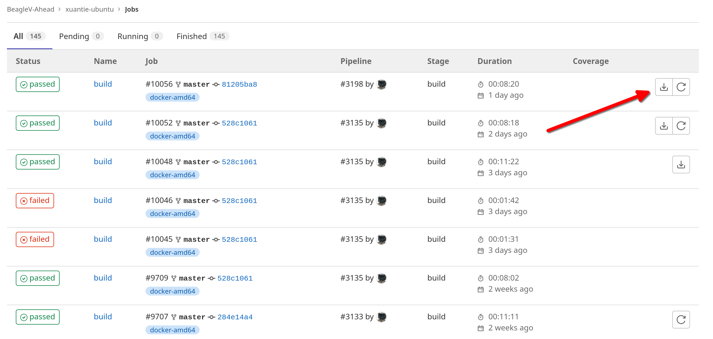

# Flashing Ubuntu image

To start flashing the board download the latest image from the link below:

https://git.beagleboard.org/beaglev-ahead/xuantie-ubuntu/-/jobs

```
NOTE: New jobs are being executed regularly and it's recommended to download the most recent Ubuntu image by clicking the buttom marked in the image below.
```



## Extract files
After downloading the `xuantie-ubuntu-<job-ID>.zip` using the link above, extract the zip file. The zip file has four files shown below:

    [lorforlinux@fedora deploy] $ ls 
        boot.ext4  fastboot_emmc.sh  root.ext4  u-boot-with-spl.bin

## Flash Board over USB

Press the USB button near SD card holder and then connect the board to PC with your custom USB3 (blue) cable provided with the BeagleV Ahead board. Now, Execute the command below, provide your password and the flashing will start.


    [lorforlinux@fedora deploy] $ sudo ./fastboot_emmc.sh 
    [sudo] password for lorforlinux:

```
NOTE: you may require to install adb & android-fastboot onto your system if not already available.
```
